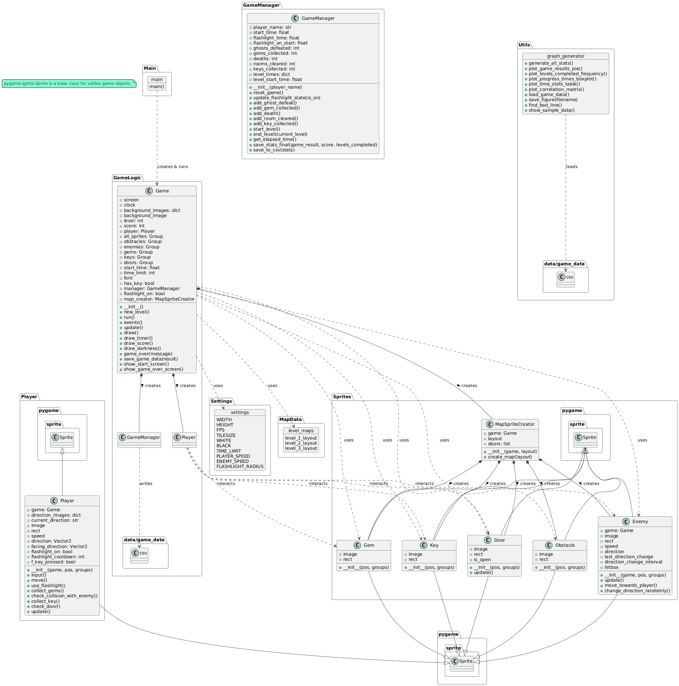

# Horror Light

## Descend into Darkness: A Survival Horror Game

[]

**Horror Light** is a Python-based survival horror game developed with the Pygame library. Navigate perilous, dimly lit environments armed only with your wits and a flashlight. Avoid horrifying enemies, uncover secrets, collect vital items, and track your struggle for survival through detailed statistics.

---

## UML Diagram


---

## ✨ Key Features

* **Explore Multiple Levels:** Venture through unique, dark, and challenging maps.
* **Flashlight Mechanics:** Your primary tool for seeing in the dark, managing its limited battery is crucial.
* **Enemy Encounters:** Confront or evade a variety of dangerous entities.
* **Collectibles & Objectives:** Find keys to progress and gems to increase your score.
* **Survival Stats:** Track your performance, including score, time, enemies defeated, and game outcome (`win`, `killed_by_enemy`, `timeout`).
* **Data Visualization:** Generate graphical reports from your gameplay data to analyze performance trends.
* **Immersive Atmosphere:** Designed to create a tense and eerie player experience.

---

## 🛠️ Technologies Used

* **Python:** The core programming language.
* **Pygame:** Library for 2D game development.
* **Pillow:** Used for image handling, particularly animated GIFs.
* **Matplotlib & Pandas:** Utilized by the statistics generator script for data analysis and plotting.
* **CSV:** Format used for logging game statistics.

---

## ⚡ Quick Start

Follow these steps to get the game running quickly:

1.  **Prerequisites:** Ensure you have **Python 3.7+** installed.
2.  **Clone/Download:** Get the project files onto your machine.
3.  **Install Dependencies:** Open your terminal in the project's root directory and run:
    ```bash
    pip install -r requirements.txt
    ```
4.  **Run the Game:** From the same terminal location, execute:
    ```bash
    python game.py
    ```
    The game window should appear.

**To view your game statistics:**

After playing a few games, run the graph generator script from the project root:
```bash 
        python graph_generator.py
```
Graphs will be saved in the data/stats/ folder.


📂 Project Structure
The project is structured as follows:

Root Directory (Horror_Light/)

main.py: Starts the game.
requirements.txt: Lists Python dependencies.
README.md: This file.
Assets (assets/)

Contains all images (backgrounds, sprites for characters, enemies, items, obstacles), fonts, and other media.
Data & Analytics (data/)

Manages game data.
game_data.csv: Stores records of completed games.
stats/: Location for generated graph images.
game_manager.py: Handles game state, scoring, and saves/loads data.
graph_generator.py: Script to process game_data.csv and create visual statistics.
Game Core Modules

game.py: Manages the main game loop, level loading, and rendering.
player.py: Defines the player character's behavior.
map.py: Contains the definitions for game levels.
settings.py: Stores game configuration constants.
sprites.py: Defines classes for various game objects (walls, enemies, items, etc.).


Developed By
Natcha Limsuwan (6710545652)

MIT License
Copyright (c) 2025 Natcha Limsuwan 

Permission is hereby granted, free of charge, to any person obtaining a copy
of this software and associated documentation files (the "Software"), to deal
in the Software without restriction, including without limitation the rights
to use, copy, modify, merge, publish, distribute, sublicense, and/or sell
copies of the Software, and to permit persons to whom the Software is
furnished to do so, subject to the following conditions:

The above copyright notice and this permission notice shall be included in all
copies or substantial portions of the Software.

THE SOFTWARE IS PROVIDED "AS IS", WITHOUT WARRANTY OF ANY KIND, EXPRESS OR
IMPLIED, INCLUDING BUT NOT LIMITED TO THE WARRANTIES OF MERCHANTABILITY,
FITNESS FOR A PARTICULAR PURPOSE AND NONINFRINGEMENT. IN NO EVENT SHALL THE
AUTHORS OR COPYRIGHT HOLDERS BE LIABLE FOR ANY CLAIM, DAMAGES OR OTHER
LIABILITY, WHETHER IN AN ACTION OF CONTRACT, TORT OR OTHERWISE, ARISING FROM,
OUT OF OR IN CONNECTION WITH THE SOFTWARE OR THE USE OR OTHER DEALINGS IN THE
SOFTWARE.
