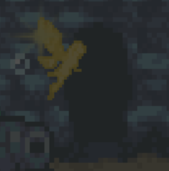

# Horror Light

How to play ! ( run --> **game.py** )
- Press Q for turn on the flashlight.
- When the flashlight on all ghosts will fly follow you.
- You have to use light from flashlight to project towards ghosts to eliminate them.
- Don't forget to collect the key to advance to the next level through the door with the golden angel in front.

**Horror Light** is a survival horror game developed using Python and the Pygame library. Navigate dark and eerie environments

## 📂 Project Structure
The project is organized as follows:

* **Root Directory** (`Horror_Light/`)
    * `requirements.txt`: Lists all necessary Python libraries for the project.
    * `README.md`: This documentation file.

* **Assets** (`assets/`)
    * Contains all graphical and audio assets for the game.
    * `BG/`: Stores background images for different levels.
    * `character/`: Contains sprite images for the player character.
    * `enemies/`: Holds sprite images for game enemies.
    * `items/`: Includes sprites for collectible items like gems and keys.
    * `obstacles/`: Contains sprites for static game obstacles (e.g., walls).
    * `roundfont.ttf`: Custom font file used in the game UI.
    * `loading.gif`: An animated image used for visual effects.

* **Data & Statistics** (`data/`)
    * Handles game data persistence and statistical analysis.
    * `game_data.csv`: A CSV file where detailed gameplay statistics are logged.
    * `stats/`: A directory where graphs generated from `game_data.csv` are saved.
    * `game_manager.py`: Manages the overall game state, tracks score and statistics, and handles saving data to `game_data.csv`.
    * `graph_generator.py`: A script dedicated to reading `game_data.csv` and generating visual statistical reports (graphs).

* **Game Core Modules**
    * Contains the fundamental logic and components of the game.
    * `game.py`: Implements the main game loop, manages levels, renders the game world, and orchestrates interactions between components.
    * `player.py`: Defines the player character's behavior, movement, interactions (flashlight, items), and collision handling.
    * `map.py`: Contains data structures and logic for defining the layout, entities, and geometry of different game levels.
    * `settings.py`: A configuration file containing global constants such as screen dimensions, speeds, colors, and time limits.
    * `sprites.py`: Defines Python classes for all different types of game objects (sprites) like obstacles, enemies, items, etc., inheriting from `pygame.sprite.Sprite`.

📦 Installation
To set up and run Horror Light, follow these steps:
- Install Python: Ensure you have Python 3.7+. 
                Download from https://www.python.org/downloads/ if needed.
- Clone the Repository: Clone the project to your local machine.
- Install Dependencies: Navigate to the project directory in your terminal and run:
                      pip install -r requirements.txt
* This installs Pygame, Pillow, Matplotlib, Pandas, and any other necessary libraries. *

🚀 How to Run
Open Terminal: Navigate to the root of the project directory.
Run the Game: python game.py

📊 Viewing Statistics
After playing, you can generate graphs from the collected data:
Open Terminal: Navigate to the root of the project directory.
Generate Graphs : Run --> python graph_generator.py

**Graphic Screen & Charter Credit** : [https://finalbossblues.itch.io/atlantis-tileset](https://finalbossblues.itch.io/atlantis-tileset)

MIT License
Copyright (c) 2025 Natcha Limsuwan

Permission is hereby granted, free of charge, to any person obtaining a copy
of this software and associated documentation files (the "Software"), to deal
in the Software without restriction, including without limitation the rights
to use, copy, modify, merge, publish, distribute, sublicense, and/or sell
copies of the Software, and to permit persons to whom the Software is
furnished to do so, subject to the following conditions:

The above copyright notice and this permission notice shall be included in all
copies or substantial portions of the Software.

THE SOFTWARE IS PROVIDED "AS IS", WITHOUT WARRANTY OF ANY KIND, EXPRESS OR
IMPLIED, INCLUDING BUT NOT LIMITED TO THE WARRANTIES OF MERCHANTABILITY,
FITNESS FOR A PARTICULAR PURPOSE AND NONINFRINGEMENT. IN NO EVENT SHALL THE
AUTHORS OR COPYRIGHT HOLDERS BE LIABLE FOR ANY CLAIM, DAMAGES OR OTHER
LIABILITY, WHETHER IN AN ACTION OF CONTRACT, TORT OR OTHERWISE, ARISING FROM,
OUT OF OR IN CONNECTION WITH THE SOFTWARE OR THE USE OR OTHER DEALINGS IN THE
SOFTWARE.
